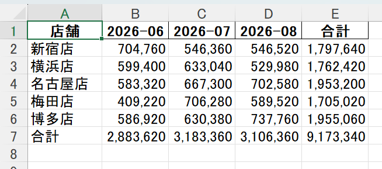
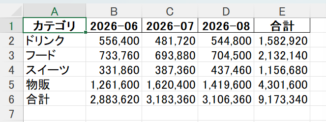
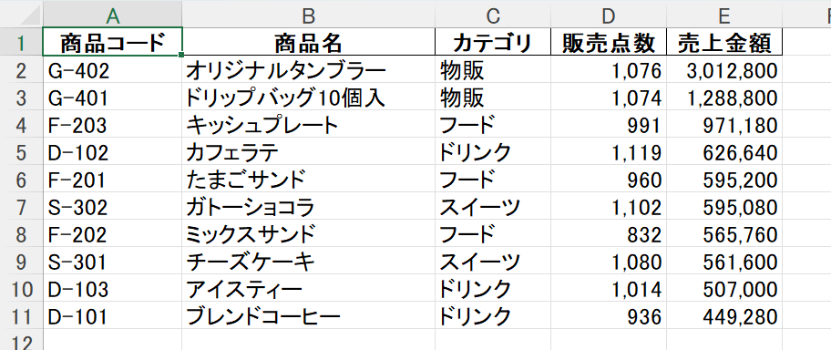
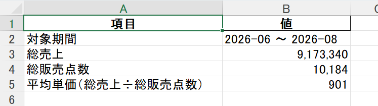

# 店舗別売上集計ツール

複数店舗・複数月のバラバラな売上CSVを、会議にそのまま出せる集計済みExcelに変換するツールです。

## デモ

<!-- TODO: 30秒程度のデモGIFをここに置く（python main.py 実行 → output/ のExcelが開くまで） -->
`python main.py` を実行するだけで、`data/` の15ファイルから `output/売上集計_YYYYMM.xlsx` が数秒で出来上がります。

## 出力例

実際に生成されたExcelの4シートです（サンプルデータ：5店舗×3ヶ月・1,600明細）。

**店舗別**



**カテゴリ別**



**商品別（上位10件）**



**サマリ**



これらの数字は、本ツールとは別経路（pandasを使わない素のPython）での独立検算と1円単位で一致することを確認済みです。

## Before / After

| | 内容 | 所要時間 |
|---|---|---|
| Before | 店舗ごとのCSVを手でExcelに開き、コピペで店舗別・カテゴリ別の集計表を作る | 毎月 約3時間 |
| After | `python main.py` を実行するだけ | 数秒 |

## これは何

5店舗を運営する小規模カフェチェーンを想定した、売上集計の自動化ツールです。

POSレジから店舗ごと・月ごとに出力される売上CSVは、店舗によって列名が微妙に違ったり、金額にカンマが入っていたりと、素直には読めない形で出てきます。これを手でExcelに開いて直しながら集計する作業を、コマンド1つに置き換えます。

## できること

`data/` 配下のCSVをすべて読み込み、次の4種類の集計をExcel1ファイル（シート4枚）にまとめます。

1. 店舗別 × 月別の売上合計
2. カテゴリ別 × 月別の売上合計
3. 商品別の売上合計（上位10件）
4. 全体サマリ（対象期間・総売上・総販売点数・平均単価）

見出しは太字、金額は3桁区切り、列幅は内容に合わせて自動調整され、そのまま資料として使える形で出力されます。「平均単価」は**総売上 ÷ 総販売点数**で算出したもので、この定義自体をサマリシートの項目名に明記しています（単価列の単純平均ではありません）。

## 動作確認・品質保証

出力される数字の正しさを、複数の方法で検証しています。

- **独立した経路での検算**：本ツール（pandas）とは別に、pandasを使わない素のPythonで同じCSVを集計し、店舗別・カテゴリ別・月別・商品別・サマリの全項目が1円単位で一致することを確認済みです。
- **入力の異常系17パターン**：列名の揺れ、日付形式の混在、カンマ/円記号付き金額、BOM有無、空行の位置、必須列の欠落、未知の店舗名、命名規則外のファイル名、空フォルダなど、想定される異常系をテストデータで再現し、期待通りの結果（正常に読めるか／ファイル名と行番号を示して止まるか）を確認しています。テストデータは `make_test_data.py` で再生成できます。
- **実行環境**：依存ライブラリを新規インストールしただけのクリーンな仮想環境でも、開発時と同じ結果が出ることを確認しています。
- **異常終了時の挙動**：出力先のExcelを開いたまま実行した場合に、生のエラーではなく案内メッセージを出して止まることを確認しています。
- **セキュリティ**：商品名などの文字列がExcelの数式として解釈される値（`=`, `+`, `-`, `@` で始まる文字列）で始まっていても、数式として実行されないよう無害化しています。

## 対応していないもの

現状のバージョンでは、次のパターンは非対応です（エラーメッセージを出して停止します）。

- 金額に円記号などの通貨記号が付いている値（例: `¥2,040`）。カンマのみ対応。
- `sales_YYYYMM_店舗slug.csv` 以外の命名規則のファイル
- `config.py` に登録されていない店舗（未知の店舗slug）
- 必須列（日付・商品コード・商品名・カテゴリ・数量・単価・金額）のいずれかが欠けているCSV

これらに該当するデータが来た場合は、どのファイルの何が原因かを示して停止するので、実行結果を見ればすぐに判別できます。

## 使い方

```bash
pip install -r requirements.txt
python setup_data.py   # サンプルCSVを data/ に生成（初回のみ）
python main.py          # data/ を読んで output/ に集計結果を出す
```

コマンドライン引数は不要です。`data/` に自分のCSVを入れ替えれば、そのデータで集計されます。

## 入力データの前提

サンプルデータ（`setup_data.py` が生成）には、実務でよくある「汚れ」をあえて再現しています。このツールはこれらを自動で吸収します。

- ファイルによって列名が違う（`売上金額` と `金額`）
- 日付形式が混在（`2026-06-01` と `2026/7/1`）
- 金額にカンマが入っている（`"2,040"`）
- BOM付きUTF-8
- 一部ファイルの末尾に空行がある

入力に不備がある場合（想定外の列、変換できない値など）は、**どのファイルの何行目が原因かを示して停止**します。「エラーが出ました」だけで終わらせない設計です。

## プロジェクト構成

```
.
├── data/              # 入力CSV（setup_data.py で生成、店舗別・月別）
├── output/            # 出力先（集計済みExcel）
├── test_data/         # 異常系テスト用データ（make_test_data.py で生成）
├── setup_data.py      # サンプルCSV生成
├── make_test_data.py  # 異常系テスト用データの生成（本体コードは変更しない）
├── config.py          # 店舗名の対応表・列名の別名など、決めごとの定数
├── errors.py          # 入力データ不備を表す例外
├── loader.py          # CSVを読み、汚れを吸収して1枚の表にする
├── aggregate.py       # 4種類の集計を作る（純粋な集計処理のみ）
├── excel.py           # 集計結果をExcelに書き出す（インジェクション対策含む）
├── main.py            # エントリポイント（上記を順に呼ぶだけ）
├── SPEC.md            # 仕様書（設計判断の記録を含む）
└── requirements.txt
```

## 設計の考え方

先に15ファイルすべてを「1行1明細・列の揃った縦持ちの表」に正規化してから、4種類の集計をかけています。個別のファイルをその場で集計して後から足し合わせる方式は、集計軸が複数あると突き合わせのミスが起きやすく、今回のデータの汚れ（列名の揺れ・日付形式の混在・カンマ付き金額など）を吸収する処理も分散してしまうためです。

ファイルの分割も、変更する理由が違うものを別ファイルにしています（入力の形が変わる／集計軸が増える／見た目を直す、はそれぞれ別のタイミングで起きるため）。詳しい設計判断は [SPEC.md](./SPEC.md) に記録しています。

## 技術スタック

- Python 3
- pandas
- openpyxl

## 開発について

コードの実装には Claude Code（AIコーディング支援）を使っています。
仕様と設計判断（ファイル分割の方針、エラー時の挙動、対応範囲の線引き）は
SPEC.md にまとめています。

## 今回やらないこと（スコープ外）

- GUI
- データベース連携
- 前月比・前年比などの分析
- グラフの自動生成

## ライセンス

個人のポートフォリオ／学習プロジェクトです。現時点でライセンスファイルは設定していません（無断転載・改変・商用利用は不可）。再利用可能な形にしたい場合は別途ライセンスを設定します。
